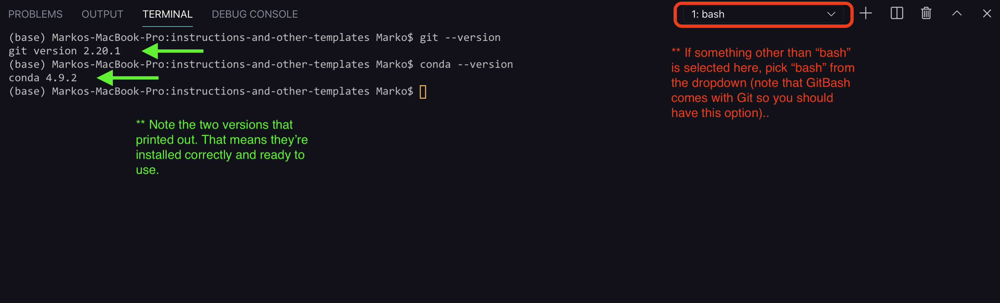

<!-- PROJECT LOGO -->
 

  

    
  

  <h3 align="center">Computer Setup</h3>

  

    Getting the tools needed to run Sauder LS, Canvas API projects
     
  

> Note that the `$` character in these docs is not part of the command but rather is a commonly used symbol to indicates that what follows is a terminal command.

> 💡 The basic setup for working with any Sauder LS Canvas API tools is:
>
> - A tool for getting/updating projects
> - An environment to run it in

[GitHub](https://github.com) is our tool for distributing projects and managing updates. We discuss GitHub in more detail in a later section ([Managing Projects with GitHub](github-project-management.md)). For now you'll need to:

-  :white_check_mark: [Create a free GitHub Account](https://github.com/join)
-  :white_check_mark: _For LS-Ops:_ Contact someone on the Canvas API team to be added to the saud-learning-services/ls-ops team on GitHub (you'll need this to access certain projects)

Next up, we'll be installing [Git](https://git-scm.com/downloads) - not to be confused with GitHub. Note that installing Git comes with Git Bash, a commonly used command-line interface (CLI). You won't have to worry about that information though, just follow the steps below.
- :white_check_mark: Install the latest version of [Git](https://git-scm.com/downloads)

> 💡Git Bash offers a more consistent experience across different operating systems (Windows, macOS, Linux) and offers additional features and capabilities compared to the default Windows Command Prompt. In other words, you should really install Git!

[Miniconda](https://conda.io/projects/conda/en/latest/user-guide/getting-started.html) is our tool for installing the Conda package and environment management system. Downloading Miniconda gives you a lightweight foundation for using Conda and Python, allowing you to build a custom environment suited to your specific requirements.

- :white_check_mark: [Download Miniconda](https://docs.conda.io/en/latest/miniconda.html) but make sure it's the right version for your specific device! After the download has finished, run the installer and accept the **default configuration** for all pages.

    

Once Miniconda is installed, open the Start Menu. Typically, you can find the menu button along the top or bottom of your screen in the form of the Windows logo or Apple logo. Search for the program called _Anaconda Prompt (miniconda3)_. When this opens you will see a prompt similar to `(base) C:\Users\your_name`. Type the following to check that your Python installation is working:
- :white_check_mark: Run the command `python --version` (a version number should print out)
- :white_check_mark: Run the command `conda --version` (a version number should print out)
- If the installation was successful, the output should look similar to this:

    

> 💡If you get any error outputs, recheck if you downloaded the wrong version of Miniconda for your device. Otherwise, contact the Sauder Canvas API Team for for support.

We can make the Anaconda Prompt available from the Git Bash terminal by default, which is what we will be using most of the time. Open the “Anaconda Prompt (miniconda3)” again and try this to configure Git Bash:
- :white_check_mark: Run the command `conda init bash` which should look similar to this:

    

Visual Studio Code (more commonly known as VS Code) is a popular code editor allowing us to write new code, modify existing code, or run command line tasks in its [integrated terminal](https://code.visualstudio.com/docs/editor/integrated-terminal). All our projects are built to run in both Jupyter notebooks and directly in terminal. Follow the steps below to download and configure VS Code:
- :white_check_mark: [Download Visual Studio Code](https://code.visualstudio.com/download)
- :white_check_mark: Launch VS Code, then launch a new terminal in VS Code. Do this by selecting from the top menu **Terminal > New Terminal**. Select the (Git) Bash command-line interface for the terminal (top right in the photo below). Then, run the commands `$ git --version` and `$ conda --version` (version numbers should print out). The end result should look similar to this:

    

- :white_check_mark: (still working in VS Code Bash terminal) Run the command `$ conda install jupyter` and respond with `yes` or `y` to all configuration options. This allows users to work with Jupyter Notebook and other Jupyter-related components within your Conda environment.

> 💡 If anything is still unclear regarding the VS Code setup, refer to [Running Scripts with Terminal & Visual Studio Code](terminal-vscode-running-instructions.md). If any errors have popped up, go through previous steps to see if you configured Git Bash correctly when working in the Anaconda Prompt (miniconda3) window. Otherwise, contact the Sauder Canvas API Team for support.

Once you have done all the above, you're ready to start downloading and running projects.

We've provided a 👷 [Setup Test Project](https://github.com/saud-learning-services/setup-test) on our GitHub that you can use throughout the remainder of the documentation to ensure you have everything up and running correctly. We'll provide you with a step-by-step on how to get this project running on your machine, and you can apply this same process to all tools.

Once everything is configured correctly, you should see an output of "Hey {your-name-on-canvas}":

    

> 💡 Every reference to the test project in the remainder of the docs will be labeled using the 👷 icon

[➡️ Next: Managing Projects with GitHub](terminal-vscode-running-instructions.md)