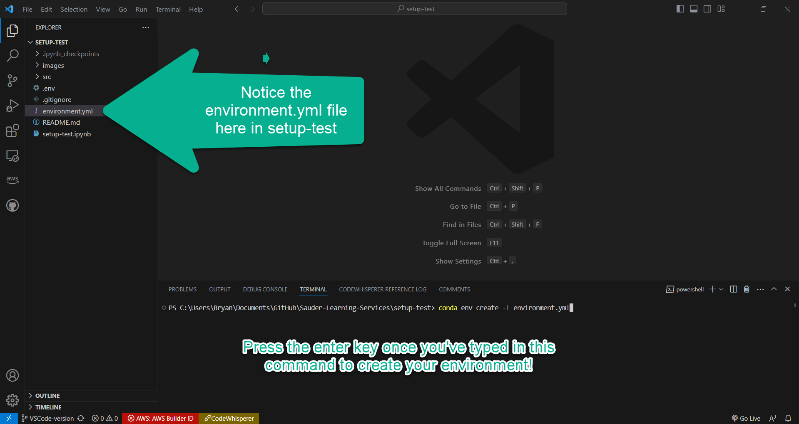

 

  

    
  

  <h3 align="center">Environment Setup</h3>

  

    Setting up Environments for Sauder LS Projects
     
  

> ⚠️ Before reading on, ensure you've covered [Computer Setup](computer-setup.md), [Visual Studio Code Setup](vscode-setup.md), and [Managing Projects with GitHub](github-project-management.md).

> 💡 Note that the `$` character in these docs is not part of the command but rather is a commonly used symbol to indicates that what follows is a terminal command. By "running a command", we mean typing that command and then pressing the _enter_ key. If ever stuck working in terminal, visit [Terminal Basics](terminal-basics.md).

> ⚠️ All references to **the-project** should be the name of the tool you are running.

After downloading one of our projects for the first time, you'll want to start by getting your environment set up. Think of the files you download from GitHub as disassembled furniture, and environments as a way of putting the furniture together. Like assembling furniture, this is done _once_ and isn't repeated every time you want to use it.

In this section we'll discuss setting up environments. Each project comes with their own `environment.yml` file (like instructions for how to assemble the furniture). You can create environments for each project, or you can utilize a **universal environment** that can be used to run any of our tools - we'll explore this [later](#universal-environment-setup).

## Configuring Environments
:white_check_mark: Follow all of the steps below in this subsection ("Configuring Environments") to know how to create a **unique project environment** configuration using Git Bash! From there, you can move onto the next section before coming back to this doc to know how to set up a **universal environment** configuration, as you will need some of the skills in the next section to install and test out the **universal environment**. We highly recommend that you follow along using the 👷 setup-test project.

1. Make sure your computer is [setup](computer-setup.md) to run our projects.
    > If you have been following along, this should be done!

2. Clone the project you need (i.e. make a local copy) from our GitHub. The [previous section](github-project-management.md#cloning-a-project-vs-code) covered detailed instructions on cloning projects from GitHub.

   > 💡 We recommend cloning all of our projects into a single location like `.../Documents/GitHub/Sauder-Learning-Services`. It is important to recall where you are cloning to, as this is where you will find the `environment.yml` file (discussed below). If you are working through 👷 setup-test and our docs, then this should be done! 

3. Open a new Bash terminal in Visual Studio Code:
 
   1. Open **VS Code** application
   2. Click on **Terminal > New Terminal** (top menu)
   3. Select **bash** or **Git Bash** from the dropdown menu (top right in terminal)

   

      
   

4. Let's set up the environment so that we can run our scripts and then launch their jupyter notebooks. We'll use 👷setup-test for reference to walk you through the steps.

   1. Run `$ conda env create -f environment.yml` in terminal from the directory containing the `environment.yml` file. This command creates an environment using the `environment.yml` file in the current directory.

      > 👷 Working through the setup test? The environment setup-test will be created from `environment.yml` contained in your local **setup-test** folder.

      > 💡 Note that every project has their own `environment.yml` file so it's important to make sure you select the right one. You can always ensure you have the right script by checking the name field matches your tool name after importing the yml file.

      

         
      

   1. Activate the environment we just made using the command `$ conda activate <environment-name>` in terminal. Wait for installation to complete.
      > 💡 This may take some time (shouldn't be any longer than 20 minutes though). Make yourself a coffee and kick your feet up~

      > 👷 In the case of setup-test, the command we run is `conda activate setup-test` since **setup-test** is the environment name created in the previous step.

Once this completes, you will have successfully set up your environment! Now you are ready to run the tool. The following subsection goes through how to set up a single environment for all projects. We recommend this method over creating individual environments for each tool, as it requires the least amount of maintanace.

[➡️ Next: Running Scripts](running-instructions.md)

## Universal Environment Setup

> 💡 Recommended for Operations team

While each of our projects comes with their own `environment.yml` file for setting a project-specific environment, we also offer a universal environment, called **canvas-universal-env**, that can be used to run _any_ of our projects that work with the Canvas API.

If you set up your universal environment correctly, you can use and update only that environment instead of managing one independently for each project.

> ⚠️ Every project that supports the universal environment will say **supports universal environment 🌎** at the top of its GitHub page.

### Installation

:white_check_mark: Follow the steps in this subsection to properly install **canvas-universal-env** locally on your device.

1. Clone [this](https://github.com/saud-learning-services/instructions-and-other-templates) project to your computer (Not sure how? Revisit [Managing Projects with Github](github-project-management.md)).
> 💡 Clone the project to the same place you're keeping all of the projects: `Documents/GitHub/Sauder-Learning-Services/`
2. Launch VS Code, open the project you just cloned from GitHub, and launch a new Bash terminal. Need help? Refer to the [Configuring Environments](#configuring-environments) section a few scrolls above.
3. In terminal, run the commands `$ conda env create -f universal-environment.yml` followed by `$ conda activate instructions-and-other-templates`.
> ⚠️ Be patient, you may have to wait a while for these two commands to run, especially the second one. This is your cue to drink your seventh coffee of the day.

### Testing

:white_check_mark: Follow the steps in this subsection to properly test that **canvas-universal-env** has been installed correctly.

1. Open **VS Code**, then launch a new bash terminal from the top menu via **Terminal > New Terminal**. Run the command `$ jupyter notebook` or `$ jupyter-notebook`. This should open the browser automatically.

   

2. Now working in the browser, navigate to a project that supports the universal environment (👷 like setup-test for example) and select the jupyter notebook (.ipynb file).
3. Read the instructions in the notebook to see if any additional steps are needed, and if so, complete those steps.
4. Select **Kernel** > **Restart & Run All**. The Jupyter Notebook may prompt you for some inputs but should otherwise run without errors. If there are no errors, **canvas-universal-env** has been installed correctly.

> ⚠️ Getting errors? Still confused? Don't forget to contact the Sauder Canvas API team for support.

[➡️ Next: Running Scripts](running-instructions.md)