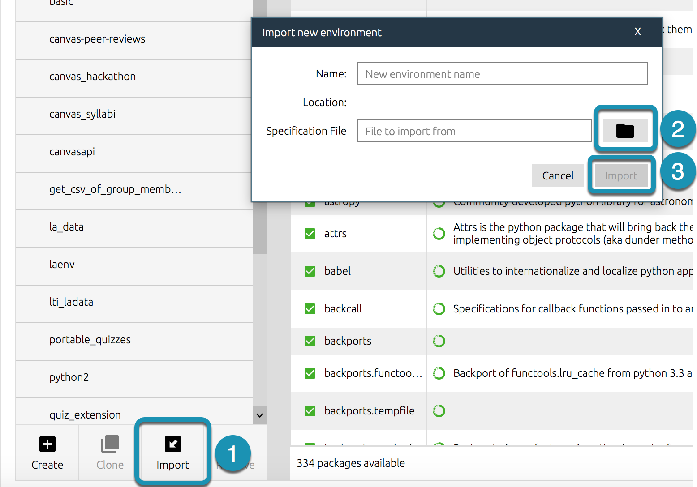

 

  

    
  

  <h3 align="center">Environment Setup</h3>

  

  Setting up environments for Sauder LS, Canvas API Projects
     
  

> ⚠️ Before reading on, ensure you've covered [computer setup](computer-setup.md) and [github project management](github-project-management.md)

> ⚠️ All references to **the-project** should be the name of the tool you are running.

After downloading one of our projects for the first time, you'll want to start by getting your environment set up. Think of the files you download from GitHub as disassembled furniture, and environments as a way of putting the furniture together. Like assembling furniture, this is done _once_ and isn't repeated every time you want to use it.

In this section we'll discuss setting up environments. Each project comes with their own `environment.yml` file (like instructions for how to assemble the furniture). You can create environments for each project, or you can utilize a **universal environment** that can be used to run any of our tools - we discuss how to get this setup [below](#universal-environment-setup).

## Configuring Environments

1. Make sure your computer is [setup](computer-setup.md) to run our projects

1. Clone the project you need (i.e. make a local copy) from our GitHub. See [here](github-project-management.md) for detailed instructions on getting and managing projects.

   > 💡 We recommend cloning all of our projects into a single location like `.../Documents/GitHub/Sauder-Learning-Services`

1. Open Anaconda Navigator:

   1. Open **Anaconda Navigator** application
   2. Click on **Environments** (left panel)
   3. Click on **Import** (bottom)

   

      
   

1. Import Environment

   1. A small window will open, navigate to the **the-project** folder on your computer and select the containing file: `environment.yml`

      > ⚠️ Do not manually enter the project name. This will automatically be filled in when you select the `environment.yml` and will be the same name as the project foler (i.e. the-project)

      > 💡 Note that every project has their own `environment.yml` file so it's important to make sure you select the right one. You can always ensure you have the right script by checking the name field matches your tool name after importing the yml file

      > 👷 Working through the setup test? Import the `environment.yml` contained in your local **setup-test** folder.

   1. Select **Import** and wait for installation to complete
      > 💡 This may take some time (upwards of 20 minutes). Note that this process can be sped up by working in Terminal instead of Anaconda-Navigator, if comfortable.

   

      
   

Once this completes, you will have successfully set up your environment! Now you are ready to run the tool. The following section goes through how to setup a single environment for all projects. We recommend this method over creating individual environments for each tool, as it requires the least amount of maintanace.

## Universal Environment Setup

While each of our projects comes with thier own `environment.yml` file for setting a project-specific environment, we also offer a universal environment, called **canvas-universal-env**, that can be used to run _any_ of our projects that work with Canvas.

If you setup your universal environment correctly, you can use and update only that environment instead of managing one independently for each project.

> - ⚠️ Every project that supports the universal environment will say **supports universal environment 🌎** at the top of its GitHub page.
> - 💡 Recommended for Operations team

### Installation

> 👷 Working through the setup test? Now is a good time to get the universal environment setup! 

1. Clone [this](https://github.com/saud-learning-services/instructions-and-other-templates) project to your computer (Not sure how? Revisit [Managing Projects with Github](managing-projects-with-github.md)).
2. In Anaconda Navigator, import the `universal-environment.yml` file in the `instructions-and-other-templates` folder (cloned from GitHub in Step 1)
3. You should now see a new environment called **canvas-universal-env** in your environments list.

### Testing

1. Select the ▶ button next to **canvas-universal-env**, then **Open with Jupyter Notebook**. Your browser should open automatically.
2. Navigate to a project that supports the universal environment (👷 like setup-test for example) and select the jupyter notebook (.ipynb file)
3. Read the instructions in the notebook to see if any additional steps are needed (and if so complete those steps)
4. Select **Kernal** > **Restart & Run All**. The Jupyter Notebook may prompt you for some inputs but should otherwise run without errors.

> ⚠️ Getting errors? Confused? Don't forget to contact the Canvas API team for support.

[➡️ Next: Running Instructions](running-instructions.md)
