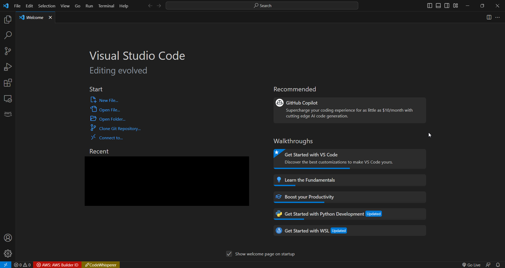
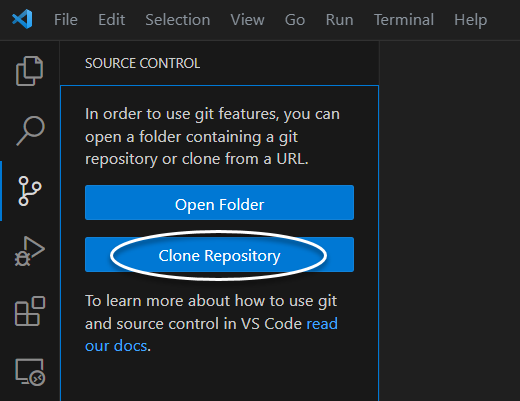
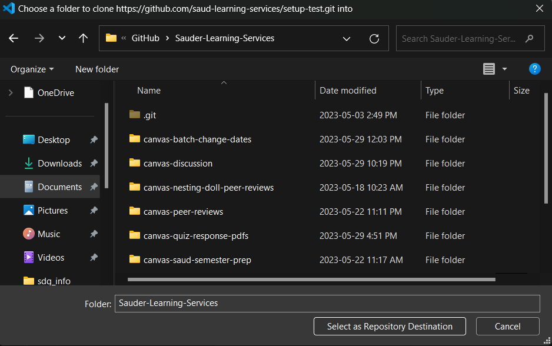
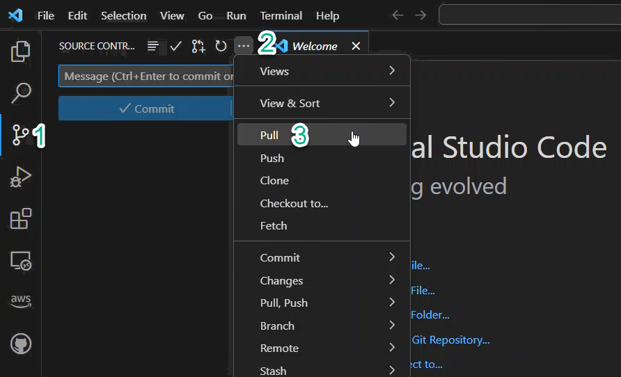

<!-- PROJECT LOGO -->
 

  

    
  

  <h3 align="center">Managing Projects with GitHub</h3>

  

    A Guide for Managing Sauder LS Projects using GitHub
     
  

> ⚠️ Before reading on, ensure you've covered [Computer Setup](computer-setup.md) and [Visual Studio Code Setup](vscode-setup.md).

> 💡 Note that the `$` character in these docs is not part of the command but rather is a commonly used symbol to indicates that what follows is a terminal command. By "running a command", we mean typing that command and then pressing the _enter_ key. If ever stuck working in terminal, visit [Terminal Basics](terminal-basics.md).

## What is GitHub?

GitHub is a website that allows people to share and collaborate on software projects. All projects on GitHub use a version control system called Git, which you should have installed in [Computer Setup](computer-setup.md). For the purposes of using Sauder LS tools, it's enough to know that GitHub will be:

- Where you'll be downloading projects from
- How you will recieve updates

## Why Use GitHub?

GitHub helps us with version control. Crucially, it'll help us ensure that everyone is using the most up-to-date versions of our tools. It will also help us respond to problems faster and send fixed code back to our users without creating any kind of duplication or confusion around which version is correct.

_Here's a scenario we're trying to avoid..._

Say you _manually_ download one of our tools to a folder on your computer like so:

    

Now over time, we make improvements to the tool, and let you know we've posted version 2, followed by version 3. Over time your project folder starts to look like:

    

This has a lot of downsides:

- It makes it hard to keep track of which version is the "right" version
- Data can get lost or forgotten in folders of previous versions
- Users can miss crucial updates

GitHub solves this by allowing us to host all our tools online and have everybody connect to the same "folder in the cloud" so to speak. This way everyone can be sure they're using the latest version of the code and any changes to the code can reach everybody.

    
    
e.g. how we send out updates through GitHub

## Managing Projects Using VS Code

First, you'll need a GitHub account.
- :white_check_mark: [Create a GitHub account!](https://github.com/join)
- :white_check_mark: For any Sauder LS staff, get in touch to let someone from the API team and let them know you have an account and want to be added to the organization. Some projects for LS-ops are private and you must be a member of the organization to view/use them.

:white_check_mark: If not already downloaded, download [VS Code](https://desktop.github.com/). Among the things VS Code can do are: 
- write new code
- modify existing code
- run command line tasks in its integrated terminal
- download and contribute to projects hosted on GitHub

Once downloaded, open the application. It should look something like this:

    

## Create a local project folder
:white_check_mark: We recommend using `Documents/GitHub/Sauder-Learning-Services` to store all projects. If you haven't already, create a GitHub folder in Documents, and a Sauder-Learning-Services folder within the GitHub folder. This way, it becomes much easier to find where all your projects are stored if you cloned them to the same folder `../Sauder-Learning-Services`.

> 💡 Documents can be easily found in File Explorer (Windows) or Finder (macOS) as it is one of the default user directories.

## Cloning a Project (VS Code)

👷 This subsection will act as a walkthrough for cloning any Sauder LS project from GitHub, but we recommend you follow along using the setup test project. Here is the link to the [setup test repository](https://github.com/saud-learning-services/setup-test).
> :white_check_mark: Open up the [setup test repository](https://github.com/saud-learning-services/setup-test) and follow along the rest of this subsection.

Start by launching VS Code. Select the source control icon on the left navigation menu, as seen below:

    

Next, obtain the GitHub URL of the project you are trying to get. To find this, visit a project page on GitHub and copy the link as seen below (click "Code" then the clipboard icon):

> :white_check_mark: Revisit the link to the 👷 [setup test repository](https://github.com/saud-learning-services/setup-test) and copy the link via the big green button which says "Code"!

    

Back in VS Code, click on the **Clone Repository** button, which should be blue. You will be prompted to input a repository URL. This is where you paste in the URL obtained from GitHub, then press the enter key. You will then be required to select a folder to place the project in. As mentioned earlier, we recommend storing all Sauder LS projects in a single folder `Documents/GitHub/Sauder-Learning-Services`.

> 💡 We recommend using `.../Documents/GitHub/Sauder-Learning-Services` to store projects.

    

    

After cloning, this should open up a new window with the new project in the folder you've specified.

> 👷 Working through the setup test? The setup test project should have opened up in a new window. Furthermore, you can check if **setup-test** is one of the folders in the `../Sauder-Learning-Services` folder via File Explorer (Windows) or Finder (macOS).

## Updating a Project (VS Code)

:white_check_mark: _Read this - but note it won't apply your first time downloading a project because everything will be up to date!_

When we update a tool, we send those updates to GitHub where you can download or "fetch" them for your local copy.

To do this in VS Code, open up the project and follow the following sequence: **Source Control Tab > Views and More Actions... > Pull**. This tends to be the easiest method to manually pull updates from GitHub for beginners.

    

Your project will update to the the most recent version! The project remains in the same location as before and if you had any data outputs in the project folders prior to fetching, that data will persist.

> 💡 If manually pulling from GitHub, and you're prompted to choose a branch, always choose either **main** or **master**.

> ⚠️ Please **DO NOT select Commit to main** unless you are contributing code! You will likely never have to ever **Push** or **Commit to main**.

> ⚠️ While we will try to communicate major updates to our team, it is advisable to update the project frequently (especially if you haven't used a tool in a while). This ensures it's up-to-date and only takes a few seconds.

The following section on terminal is optional. If you'd like to continue to manage tools as described above, head to the next section on environment setup.

[➡️ Next: Environment Setup](environment-setup.md)

## (Optional) Managing GitHub Projects Using Terminal

Terminal is a good way of managing GitHub projects if you are:

1. Someone who is interested in programming or computers
1. Someone who may want to contribute to one of our projects
1. Someone who is interested in the fastest possible way to manage projects

> It is also an excellent way to be the envy of all your friends as you'll look like some kind of computer genius, with capabilities nothing short of magic-like [🧙‍♀️](https://tenor.com/view/clapping-harry-potter-applause-smile-happy-gif-5297465)

Before reading on, you'll want to have read [terminal basics](terminal-basics.md). You'll also want to make sure that you have **Git** installed and an account on **GitHub**. If you've been following along these docs up until this point, this should be done.

## Cloning a Project (Terminal)
Keep in mind that this is **OPTIONAL** for LS Ops! If you're comfortable enough working in terminal, you can probably use this as a guide for cloning the 👷 setup test project. If you need more clarification, this can be found [earlier](#cloning-a-project-vs-code).

:white_check_mark: Start by copying the GitHub URL of the project you are trying to clone. To find this, visit a project page on GitHub and copy the link as seen below (click "Code" then the clipboard icon):

    

:white_check_mark: Open up a new Bash terminal in VS Code.

    

:white_check_mark: Using the `cd` command, navigate to a folder where you'd like to store and run the project. This is likely going to take a few `cd` commands, but once you've reached `cd Sauder-Learning-Services`, you should be good to move on.

> 💡 This may sound like a broken record, but we recommend keeping all Sauder LS projects in a single folder for ease of management. Something like `.../Documents/GitHub/Sauder-Learning-Services` will do the trick. Trust us, it makes life more convenient.

Once you've navigated to the folder, you'll want to **clone** the project into it. This can be done using with running this command in terminal:
- :white_check_mark: Run the command `$ git clone <URL>` (where `<URL>` is the HTTPS link copied from the GitHub repo)

This should open up a new window in VS Code with the newly cloned project.

## Updating a Project (Terminal)
Keep in mind that this is **OPTIONAL** for LS Ops!

Using the `cd` command, navigate to the folder where your copy of the project is stored:
- `$ cd path/to/my-project`
> 👷 If working through setup test, this should get you to the directory `.../Documents/GitHub/Sauder-Learning-Services/setup-test`. We want to get to the folder of the project itself.

Check to see what branch you are on:
- `$ git branch` (the starred branch is your current branch; type **q** to exit)

If not on **main**, switch to it:
- `$ git checkout main`

While on the main branch, grab the latest changes:
- `$ git pull` which should output a short message stating whether or not the pull was successful

> ⚠️ You will likely never have to ever **Push** or **Commit to main** since you will likely never have to contribute any code changes.
> ⚠️ Getting errors? Still confused? Don't forget to contact the Sauder Canvas API team for support.

[➡️ Next: Environment Setup](environment-setup.md)