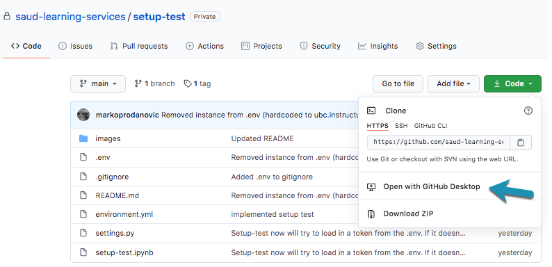

<!-- PROJECT LOGO -->
 

  

    
  

  <h3 align="center">Managing Projects with Github</h3>

  

    A Guide for Managing Sauder LS Projects using GitHub
     
    (GitHub Desktop and Terminal)
  

<!-- TABLE OF CONTENTS -->

## Table of Contents

- [Table of Contents](#table-of-contents)
- [What is GitHub?](#what-is-github)
- [Why Use It?](#why-use-it)
- [Managing Projects Using GitHub Desktop](#managing-projects-using-github-desktop)
  - [Downloading a Project (GitHub Desktop)](#downloading-a-project-github-desktop)
    - [Start from GitHub Desktop](#start-from-github-desktop)
    - [Start from the GitHub Organization](#start-from-the-github-organization)
  - [Updating a Project (GitHub Desktop)](#updating-a-project-github-desktop)
- [(Optional) Managing GitHub Projects Using Terminal](#optional-managing-github-projects-using-terminal)
  - [Downloading a Project (Terminal)](#downloading-a-project-terminal)
  - [Updating a Project (Terminal)](#updating-a-project-terminal)

💡 All Sauder LS, Canvas API tools are hosted on our [GitHub](https://github.com/saud-learning-services).

## What is GitHub?

GitHub is a website that allows people to share and collaborate on software projects. All projects on GitHub use a version control system called [Git](https://git-scm.com/). For the purposes of _using_ our tools, it's enough to know that GitHub will be:

- Where you'll be downloading projects from
- How you will recieve updates

## Why Use It?

GitHub helps us with version control. Crucially, it'll help us ensure that everyone is using the most up-to-date version of our tools. It will also help us respond to problems faster and send fixed code back to our users without creating any kind of duplication or confusion around which version is correct.

_Here's a scenario we're trying to avoid..._

Say you _manually_ download one of our tools to a folder on your computer like so:

    

Now over time, we make improvements to the tool, and let you know we've posted version 2, followed by version 3. Over time your project folder starts to look like:

    

This has a lot of downsides:

- it makes it hard to keep track of which version is the "right" version
- data can get lost or forgotten in folders of previous versions
- users can miss crucial updates

GitHub solves this by allowing us all to host all our tools online and have everybody connect to the same "folder in the cloud" so to speak. This way everyone can be sure they're on the latest version of the code and any changes to the code can reach everybody.

    
    
sending out updates through GitHub

## Managing Projects Using GitHub Desktop

> ⚠️ Recommended for Operations team

First, you'll need a GitHub account (Don't have one? [Create one](https://github.com/join)).

> 💡 For any Learning Services staff, get in touch to let someone from the API team and let them know you have an account and want to be added to the organization. Some projects (for LS-ops) are private and you must be a member of the organization to view them.

GitHub Desktop is a application that lets us download and contribute to with projects hosted on GitHub. If not already downloaded, go [here](https://desktop.github.com/)

Once downloaded, open the application. It should look something like this:

    

### Downloading a Project (GitHub Desktop)

#### Start from GitHub Desktop
Select **Clone a Repository from the Internet...** You will be prompted to sign in using your GitHub login.

Once finished, under **Clone a Repository**, select the **URL** tab

    

In the top input (marked in green), enter the GitHub URL of the project you are trying to get. To find this, visit a project page on GitHub and copy the link as seen below (click "Code" then clipboard icon):

> 👷 Working through the setup test? Visit that project and grab the URL like described above - [Link to test project](https://github.com/saud-learning-services/setup-test)

    

In the bottom input (marked in grey), choose a folder to "clone" the project to. What this does is create a copy of the tool locally on your computer. We recommend creating a single folder, somewhere accessible, where you clone all Sauder LS GitHub Projects you need.

> 💡 We recommend creating a folder like `.../Documents/GitHub/Sauder-Learning-Services` to store projects

After selecting clone, you should be able to see the new project has appeared in the folder you've specified.

> 👷 Working through the setup test? A folder titled **setup-test** should've appeared in the location.

#### Start from the GitHub Organization

If you want to start from our GitHub organization at github.com/saud-learning-services/, you can select the project that you need to clone. And then select Clone -> Open with GitHub Desktop. This will fill in the Repository URL, and the local path.

> 💡 Double check the suggested Local Path! We suggest `.../Documents/GitHub/Sauder-Learning-Services` to store projects

    

### Updating a Project (GitHub Desktop)

When we update a tool, we send those updates to GitHub where you can download or "fetch" them for your local copy.

To do this in GitHub Desktop, select the project under **Current Repository**, make sure **Current Branch** is set to **main** and click **Fetch Origin**

    

Your project will update to the the most recent version! Same location as before and if you had any data outputs in the project folders prior to fetching, that data will persist.

> ⚠️ Please **DO NOT select Commit to main** unless you are contributing code

> ⚠️ While we will try to communicate major updates to our team, it is advisable to "Fetch Origin" frequently (especially if you haven't used a tool in a while). This ensures it's up-to-date and only takes a few seconds.

The following section on terminal is optional. If you'd like to continue to manage tools with GitHub Desktop, head to the next section on environment setup.

[➡️ Next: Environment Setup](environment-setup.md)

## (Optional) Managing GitHub Projects Using Terminal

Terminal is a good way of managing GitHub projects if you are:

1. Someone who is interested in programming or computers
1. Someone who may want to contribute to one of our projects
1. Someone who is interested in the fastest possible way to manage projects

> It is also an excellent way to be the envy of all your friends as you'll look like some kind of computer genius, with capabilities nothing short of magic-like 🧙‍♀️

Before reading on, you'll want to have read [terminal basics](./terminal-basics.md)

You'll also want to make sure that you have **Git** installed and an account on **GitHub** (the two often get confused, however they're different things)

- [Install Git](https://git-scm.com/book/en/v2/Getting-Started-Installing-Git)
- [Create GitHub Account](https://docs.github.com/en/free-pro-team@latest/github/getting-started-with-github/signing-up-for-a-new-github-account) and let us know you need to join the saud-learning-services organization

### Downloading a Project (Terminal)

Using the `cd` command, navigate to a folder where you'd like to store and run the project. We recommend keeping all Sauder LS projects in a single folder for ease of management

> 💡 Something like `.../Documents/GitHub/Sauder-Learning-Services`

Once you've navigated to the folder, you'll want to **clone** the project into it. This can be done using with:

`$ git clone <URL>` (where `<URL>` is HTTPS link copied from the GitHub repo)

    
    
HTTPS links to projects can be found on the project's GitHub page

### Updating a Project (Terminal)

Using the `cd` command, navigate to the folder where your copy of the project is stored

- `$ cd path/to/my-project`

Check to see what branch you are on

- `$ git branch` (the starred branch is your curråent branch; type **q** to exit)

If not on **main**, switch toå it

- `$ git checkout main`

While on the main branch, grab the latest changes

- `$ git pull`

[➡️ Next: Environment Setup](environment-setup.md)
