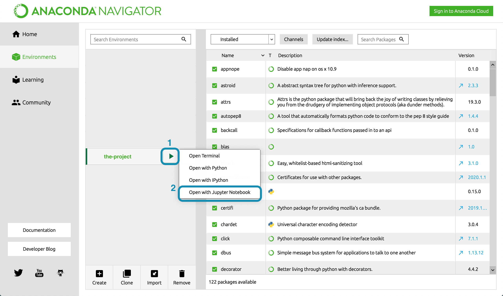
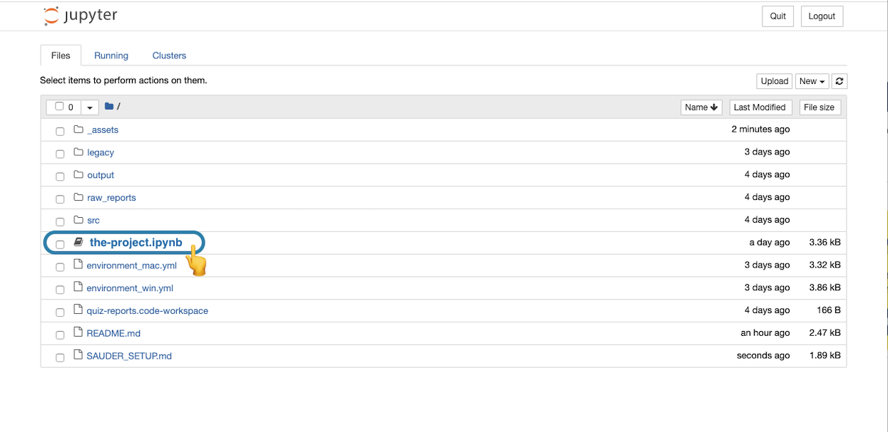

 

  

    
  

  <h3 align="center">Running Scripts</h3>

  

  A step-by-step guide for running Sauder LS, Canvas API projects
     
  

> Before you read on, ensure you've covered [Computer Setup](computer-setup.md), [Github Project Management](github-project-management.md) and [Environment Setup](environment-setup.md)

> ⚠️ All references to **the-project** should be the name of the script or project you are running.

## Running the Script

> ⚠️ Any of our tools that interact with the Canvas LMS will require you to generate a API access token. If the tool you're running does not work with Canvas, you can likely skip to Step 2. You can always refer to individual setup instructions on a project's GitHub page.

There are two ways of inputting Canvas API tokens into our tools. Most of our tools will prompt you to copy and paste your token directly into Jupyter Notebook. However, some tools will have you paste your Canvas API token into a `.env` file. **Assume you will be pasting it into Jupyter Notebook, unless the GitHub page for the tool you're working with explicitely mentions a `.env`**

> 🟢 Working on the setup-test project? We're gonna have you try **both** methods of inputting your token (first via `.env` then Jupyter Notebook)

0. Generate a Canvas Token

   - Login to Canvas and select **Account** > **Settings** from the menu on the left
   - Under **Approved Integrations** select **New Access Token**
   - Name it something of your choosing and set the expiration to the next day and select **Generate Token**

   > ⚠️ For security reasons we don't encourage setting late expiration days for tokens (keep it to a day or two)

1. Note your token somewhere (but keep it private!)
   - A long string of numbers and letters will appear, keep this somewhere on hand but **be careful to keep it private**, as it grants access to your Canvas account and should be treated as sensitive information.
   - You won't be able to access this token again once you close the dialogue box so be sure you've written it down somewhere safe.

> ⚠️ If the tool you're using makes no mention of a `.env` on its GitHub page, skip this next step (Note that most of our projects do not use `.env` files). If you are working on the 🟢 setup-test project however comes with a `.env` to familiarize you with this process.

1.1 Assign your token to the `.env` file

- Copy the token it provides you, navigate to **the-project** folder on your computer and locate the `.env` file
  > 💡 `.env` files are hidden by most operating systems by default. If you don't see a file called `.env` in **the-project** folder you likely need to _reveal hidden files_ (Instructions for [Windows](https://support.microsoft.com/en-us/windows/view-hidden-files-and-folders-in-windows-10-97fbc472-c603-9d90-91d0-1166d1d9f4b5) / [Mac](https://setapp.com/how-to/show-hidden-files-on-mac))
- Open the `.env` file with any application that can edit text _(like TextEdit or Notepad)_ Paste the token you copied from Canvas into the `.env`file (There will be an indicator in the file as to exactly where you should paste it)
- Save the `.env` file after you've pasted in your token

2. Open **Anaconda Navigator**, select the ▶ button next to **the-project** to run your environment. Then select **Open with Jupyter Notebook**, and that will launch the browser.

   > ⚠️ If you're runing via the universal environment, click the ▶ button next to **canvas-universal-env** instead (but make sure the project supports it)

   

      
   

3. In the browser, navigate to the **the-project** project folder and select **the-project.ipynb**

   > 💡 This will be located wherever you cloned it on your local computer - if you used our suggested location, all projects will be in a single folder so everything is easy to find

   

      
   

4. Read the information in the notebook! Once, you've done that select **Kernal** > **Restart & Run All** to run it

   

      
   

5. If everything was done correctly, the script should now run. Most of our projects involve some user inputs so the Jupyter Notebook will prompt and guide you from here

> 💡 Projects without a `.env` will prompt for a token at this stage. Have your Canvas API token handy to paste in as input.

> 🟢 Working on the setup-test? At this point you should see a printout like "Hi {your-name}" in text art. If you aren't seeing this, the notebook will print an error giving you an indication of what is wrong. If your problem persists, contact someone on the Sauder LS, Canvas API team for support.

> 🟢 Setup-test worked correctly? Let's try the other method of inputting tokens. Stop your environment, delete the `.env` file and restart the whole thing again. After selecting **Kernal** > **Restart & Run All** the Jupyter Notebook will ask you to provide your token as input (This is the more common way you'll see it done but it's good to be familiar with both methods!)

[➡️ Next: Updating Environments](updating-environments.md)
