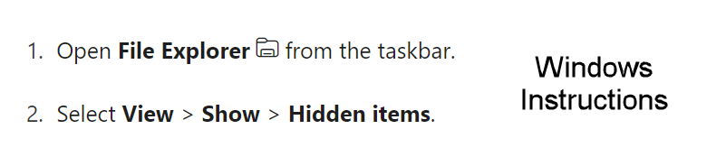
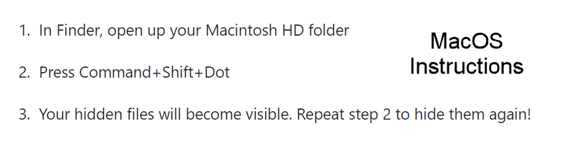
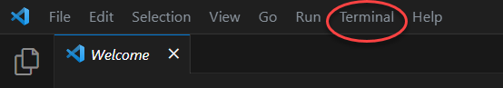
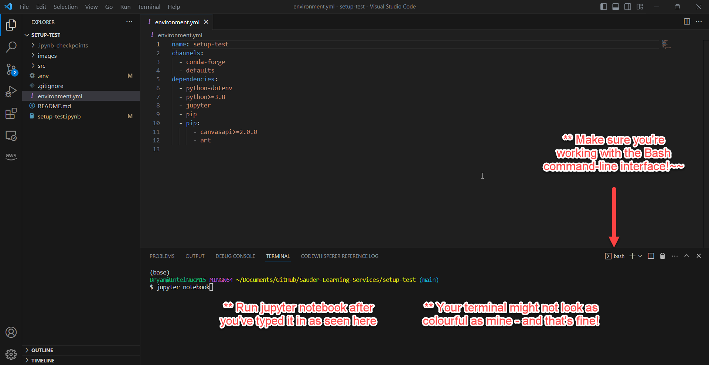

 

  

    
  

  <h3 align="center">Running Scripts</h3>

  

   A Guide for Running Sauder LS Projects
     
  

> ⚠️ Before reading on, ensure you've covered [Computer Setup](computer-setup.md), [Visual Studio Code Setup](vscode-setup.md), [Managing Projects with GitHub](github-project-management.md), and [Environment Setup](environment-setup.md).

> 💡 Note that the `$` character in these docs is not part of the command but rather is a commonly used symbol to indicates that what follows is a terminal command. By "running a command", we mean typing that command and then pressing the _enter_ key. If ever stuck working in terminal, visit [Terminal Basics](terminal-basics.md).

> ⚠️ All references to the-project should be the name of the script or project you are running.

:white_check_mark: Follow the check marks to make sure you're following the checklist!

> ⚠️ Any of our tools that interact with the Canvas LMS will require you to generate a API access token. If the tool you're running does not work with Canvas, you can likely skip to working in VS Code. You can always refer to individual setup instructions on a project's GitHub page.

There are two ways of inputting Canvas API tokens into our tools. Most of our tools will prompt you to copy and paste your token directly into Jupyter Notebook. However, some tools will have you paste your Canvas API token into a `.env` file. **Assume you will be pasting it into Jupyter Notebook, unless the GitHub page for the tool you're working with explicitely mentions a `.env`**

> 👷 Working on the setup-test project? We're gonna have you try **both** methods of inputting your token (first via `.env` then Jupyter Notebook)

:white_check_mark: Generate a Canvas token - remember that you can skip any token related steps and go straight to VS Code if your project does not work with Canvas.
   - Login to Canvas and select **Account** > **Settings** from the menu on the left.
   - Under **Approved Integrations** select **New Access Token**.
   - Name it something of your choosing, set the expiration to the next day and select **Generate Token**.
   > ⚠️ For security reasons, we don't encourage setting late expiration days for tokens (keep it to a day or two).

:white_check_mark: Note your token somewhere - _but keep it private!_
   - A long string of numbers and letters will appear, keep this somewhere on hand but **be careful to keep it private**, as it grants access to your Canvas account and should be treated as sensitive information.
   - You won't be able to access this token again once you close the dialogue box so be sure you've got it somewhere safe.
   > ⚠️ For security reasons, we don't encourage saving this token anywhere, but you can copy and paste into a text file and delete once complete.

:white_check_mark: Assign your token to the `.env` file. **If the tool you're using makes no mention of a `.env` on its GitHub page, skip this step.**
   - Note that most of our projects do not use `.env` files.
   - The 👷 setup-test project comes with a `.env` to allow you to try both methods. You will need to follow this step if you are using setup-test.
   - Navigate to **the-project** folder on your computer and locate the `.env` file.
   > 💡 `.env` files are hidden by most operating systems by default. If you don't see a file called `.env` in **the-project** folder you likely need to _reveal hidden files_. We've included the instructions to do so below for Windows and MacOS, respectively.
   

      
   

   

      
   

   - Open the `.env` file with any application that can edit text _(like TextEdit or Notepad)_ Paste the token you copied from Canvas into the `.env` file. There will be an indicator in the file as to exactly where you should paste it.
   - Save the `.env` file after you've pasted in your token.

:white_check_mark: Launch the browser from the VS Code terminal. Start here if your project does not work with Canvas.
   - Open **VS Code**, and then open the folder where your project is located. The folder should contain an environment created using the environment.yml file in the same directory.
   - Select **Terminal > New Terminal** on the top menu, which opens the terminal.
   

      
   

   - Then run the command `$ jupyter notebook` or `$ jupyter-notebook` in terminal, and that will launch the browser.
   > ⚠️ Not working? Double check that you have imported the desired environment in the [Configuring Environments](environment-setup.md#configuring-environments) step from the previous doc.
   

      
   

:white_check_mark: In the browser, navigate to the **the-project** project folder and select **the-project.ipynb**
   > 💡 This will be located wherever you cloned it on your local computer. If you used our suggested location `Documents/GitHub/Sauder-Learning-Services`, all your cloned projects will be in that single folder, making everything easier to find.
   

      
   

:white_check_mark: Read the information in the notebook! Once, you've done that select **Kernel** > **Restart & Run All** to run it.
   

      
   

:white_check_mark: If everything was done correctly, the script should now run. Most of our projects involve some user inputs so the Jupyter Notebook will prompt and guide you from here.

> 💡 Projects without a `.env` will prompt for a token at this stage. Have your Canvas API token handy to paste in as input.

> 👷 Working on the setup-test? At this point you should see a printout like "Hi {your-name}" in text art. If you aren't seeing this, the notebook will print an error giving you an indication of what is wrong. If your problem persists, contact someone on the Sauder LS, Canvas API team for support.

    

> 🧙‍♀️ If setup-test 👷 worked correctly, let's try the other method of inputting tokens. Stop your environment, delete the `.env` file and restart the whole thing again. After selecting **Kernel** > **Restart & Run All** the Jupyter Notebook will ask you to provide your token as input (This is the more common way you'll see it done but it's good to be familiar with both methods!)

> 💡 Once you are done running the Jupyter Notebook, a good practice is to restart the kernel and clear all outputs. After selecting **Kernel** > **Restart & Clear Output**, you can exit the browser with no problems.

:white_check_mark: Remember how we mentioned that it would be nice to use a universal environment for our projects? If you haven't already, now would be a good time to install and test that. We have provided you with the skills necessary to do that. Take a step back to the [previous section](environment-setup.md#universal-environment-setup).

> ⚠️ Getting errors? Still confused? Don't forget to contact the Sauder Canvas API team for support.