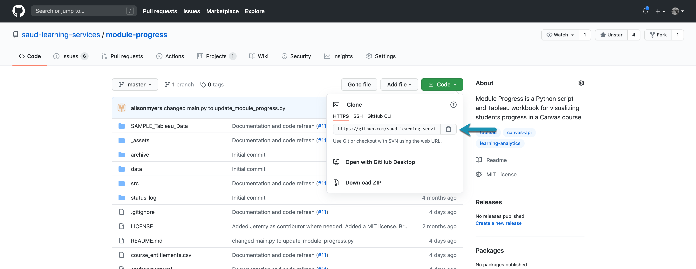

 

  

    
  

  <h3 align="center">Running Scripts in Visual Studio Code Terminal</h3>

  

    Running scripts using command line prompts
     
  

> ⚠️ This method is for more advanced users who are willing to endure a text-based environment for running scripts (done through text commands like `$ python run_script.py`). We strongly recommend getting comfortable with the [standard way of running scripts](running-instructions.md) before trying out this method.

> Note that the `$` character in these docs is not part of the command but rather is a commonly used symbol to indicates that what follows is a terminal command.

Before reading on, please make sure you've [setup your computer](computer-setup.md) and have reviewed the [terminal basics](terminal-basics.md). You'll also want to download an application called Visual Studio Code (VS Code). If you have been following the order of the docs, you would have already done this last doc in [Computer Setup](computer-setup.md):

- :white_check_mark: [Download VS Code](https://code.visualstudio.com/download)

VS Code is a popular code editor developed by Microsoft. On top of allowing us to write new code, or modify existing code, VS Code comes with a [integrated terminal](https://code.visualstudio.com/docs/editor/integrated-terminal) that will allow us to perform command line tasks like setup our environments, run scripts, provide user input, see outputs and more. All our projects are built to run in both Jupyter notebooks and directly in terminal. In many cases, we'll encourage you to launch your notebook using the command `$ jupyter notebook` which will have the same outcome of launching one through Aniconda Navigator (but can be run in a fraction of the time).

Let's start by launching a new terminal window in VS Code, and ensuring we have everything we need installed (from computer setup instructions). Launch the Visual Studio Code application, from the top menu select **Terminal > New Terminal**. You should see a window appear that looks like:

    

We should have a few commands installed (from when we downloaded Git and Anaconda Navigator). To check this run:

- `$ git --version` (a version number should print out)
- `$ conda --version` (a version number should print out)

If either throws an error, the commands are not installed correctly - contact the Sauder Canvas API team for support.

## Walkthrough Example

In this section we'll walk through an example of how to get and run a project all using the terminal in VS Code.

### Cloning a repo

When you launch your terminal for the first time, it'll open in your computer's HOME directory. Use the commands talked about in [terminal basics](terminal-basics.md) to navigate to a working directory of your choice. I'm going to navigate to my Desktop and create a folder called "terminal-test" to work in. My commands are as follows (yours may differ slightly depending on where you'd like to work)

- `$ cd Desktop` (navigate to desktop from home directory)
- `$ mkdir terminal-test` (make a folder called "terminal-test" on the Desktop)
- `$ cd terminal-test` (enter the newly-created terminal-test folder)

Now that we're in terminal test let's _clone in a project_. Visit the [setup-test repo](https://github.com/saud-learning-services/setup-test), select **Code** on the top right, select **HTTPS** and click on the clipboard icon to copy the project url (see screenshot below)

    

Back in VS Code type in the following command and paste in what you just copied in the specified location and hit enter:

- `$ git clone <paste-url-here>` (you can clone _any_ of our projects on GitHub using this syntax)

When this command completes, run the `ls` command to see the contents of your working folder, you should see a folder has been "cloned" into there called setup-test. Run `cd setup-test` to "change directory" into that repo.

To make sure you're on the `main` branch, running the latest version of the code, you'll next want to run the following two commands:

- `$ git checkout main` (to "checkout" the main branch)
- `$ git pull` (to pull in the latest changes)

### Environment Setup

Now how do we run it? Recall that in order to run our scripts we need to start up their environment and then launch their Jupyter notebook. This works exactly the same way in terminal. From the setup-test directory run:

- `$ conda env create -f environment.yml` (This command creates a environment using the environment.yml file in the current directory)

From here we can run the environment we just made using

- `$ conda activate <environment-name>` (Note that our environments share the project name, so in the case of setup test the command would be `$ conda activate setup-test`)

> At this point you might notice that the text in front of your terminal commands has changed to include (setup-test) somewhere, usually in brackets.

> Do you have your universal-environment setup as well? You can launch this environment in the same way if you'd prefer to work with only one environment: `$ conda activate universal-environment`

### Updating the `.env`

Some, but not all of our projects come with a `.env` file for setting certain parameters before execution (usually a Canvas API Tokens)

In the left panel on VS Code you should see a file called `.env` present. Click on this file and you can edit it right in VS Code (no need for any additional text editing software like before). Copy and paste your Canvas API token into this file where specified.

### Running

Now that our environment is running and we've pasted our Canvas API token into the `.env` file, we're ready to launch our jupyter notebook. In terminal run:

- `jupyter notebook`

Just like running a notebook from Anaconda Navigator, this command should launch your browser, revealing the filestructure of the folder you've run the command in. Like any file, explorer you can navigate from here and open the Jupyter Notebook file (`.ipynb`). Once you open the notebook, the rest is exactly the same as the other method. Select **Kernel > Restart & Run All** after reading the instructions and follow any additional prompts.

[➡️ Next: Managing Projects with GitHub](github-project-management.md)