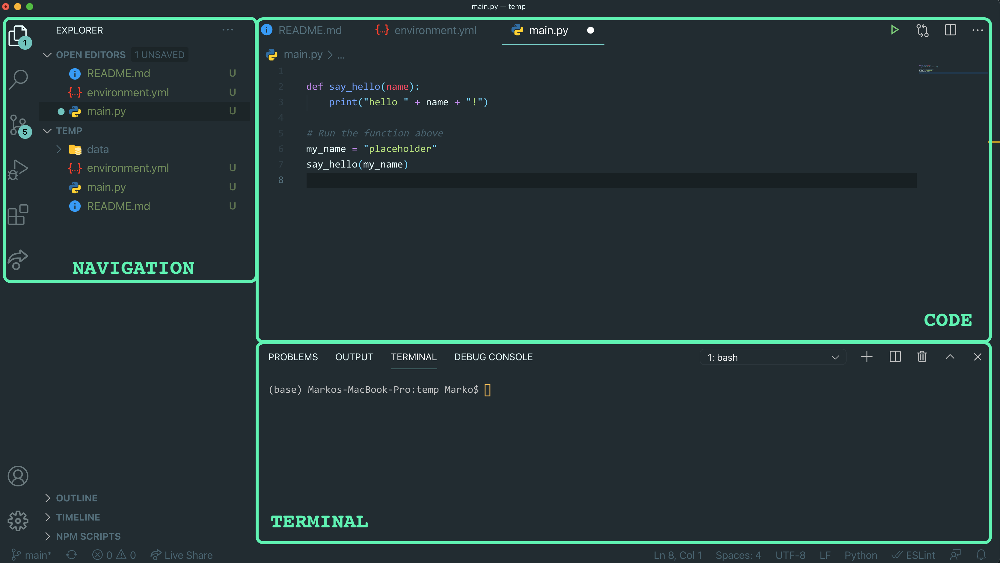

 

  

    
  

  <h3 align="center">VSCode Running Instructions</h3>

Before starting, make sure you've installed [Visual Studio Code](https://code.visualstudio.com/)

Visual Studio Code (VSCode) is a code editor. It's the tool that we use to write scripts, and it can also be used to run them.

To open a project in VSCode, navigate to it (`.../Documents/GitHub/Sauder-Learning-Services`) right-click a file in its main directory and select Open with... Visual Studio Code. Ignoring terminal, you should see something like the following:

    

> Note there may be some visual differences based on theme and preferences

In order to see the terminal you'll want to select **Terminal** from the top menu, then **New Terminal**

The pane for navigating operates esentially like a file explorer, allowing you to open new files, copy, paste, edit and more. The code area is where we write the program instructions by editing the files in the navigation. Terminal is most important for our uses case. It will allow us to activate our environment and run programs.

In the top-left corner of the Terminal window, you'll see a dropdown menu. We want this to be set to `bash`. If it isn't currently set to bash, select the dropdown and select **Select Default Shell**

Select bash from the menu, or **Git Bash** if on Windows. Restart the terminal by selecting Terminal, then New Terminal again.
