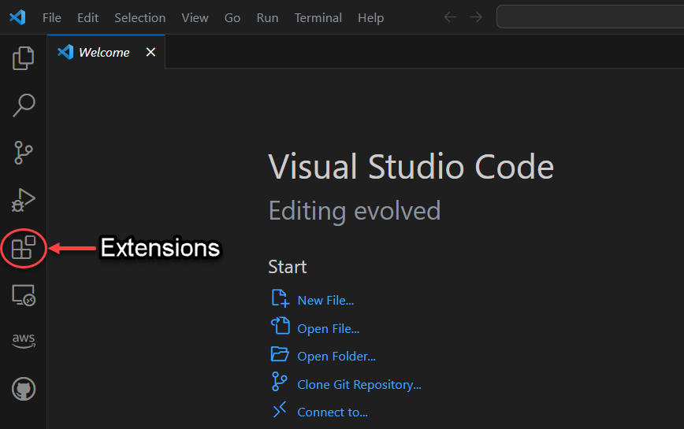
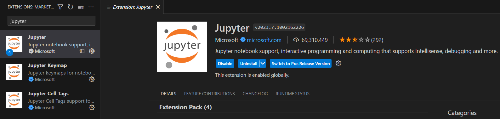
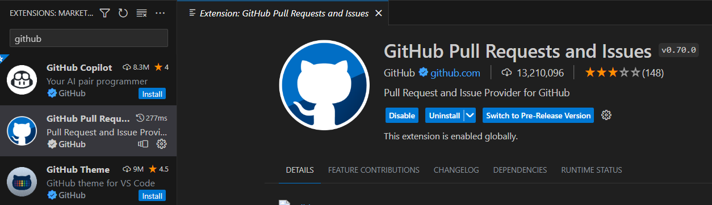

 

  

    
  

  <h3 align="center">Visual Studio Code Setup</h3>

  

    Installing and Configuring VS Code for Sauder LS Projects
     
  

> ⚠️ Before reading on, ensure you've covered [Computer Setup](computer-setup.md). More importantly, make sure that you have already installed VS Code.

> 💡 Note that the `$` character in these docs is not part of the command but rather is a commonly used symbol to indicates that what follows is a terminal command. By "running a command", we mean typing that command and then pressing the _enter_ key. If ever stuck working in terminal, visit [Terminal Basics](terminal-basics.md).

VS Code is a popular code editor developed by Microsoft. On top of allowing us to write new code, or modify existing code, VS Code comes with an integrated terminal that will allow us to perform command line tasks like setup custom environments, run scripts, provide user input, see outputs and more. All our projects are built to run in both Jupyter notebooks and directly in terminal. In many cases, we'll encourage you to launch your notebook using the command `$ jupyter notebook`, which is fast and efficient.

## Installation Configurations

Before continuing, let's make sure that everything we need for VS Code was installed correctly in the previous section. Start by launching VS Code, and then opening a new terminal.

    

Next, we want to check if Git, conda, and Python are installed and configured correctly. Make sure to run the following commands in a Git Bash terminal (this can be chosen at the top right of the newly opened terminal):
- :white_check_mark: Run the command `$ git --version` (a version number should print out)
- :white_check_mark: Run the command `$ conda --version` (a version number should print out)
- :white_check_mark: Run the command `$ python --version` (a version number should print out)

    

## Installing Extensions

Extensions in VS Code are add-ons or plugins that enhance the functionality. For our steps, we will be installing two extensions to make our life a little easier. Start off by opening the _Extensions_ tab on the left navigation bar in VS Code.
- :white_check_mark: Open the _Extensions_ tab by clicking on it or _Ctrl+Shift+X_ on your keyboard

    

The _Jupyter_ extension, developed and published by Microsoft, enhances the user experience in VS Code by providing a seamless environment for creating, editing, and running Jupyter notebooks.
- :white_check_mark: Install the _Jupyter_ extension

    

The _GitHub Pull Requests and Issues_ extension provides a seamless integration with GitHub, allowing the user to use many GitHub features without ever leaving VS Code.
- :white_check_mark: Install the _GitHub Pull Requests and Issues_ extension

    

If you installed these two extensions correctly, then the screens following the installation of the extensions should look similar to the photos provided. The blue **Install** button should have been replaced by a few other new buttons.

> 💡If you cannot open a Git Bash terminal, then you may have skipped a step in [Computer Setup](computer-setup.md). In particular, try running the command `conda init bash` in the _Anaconda Prompt (miniconda3)_ program again.
> ⚠️ Still confused? Don't forget to contact the Sauder Canvas API team for support.

[➡️ Next: Managing Projects with GitHub](github-project-management.md)