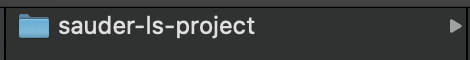
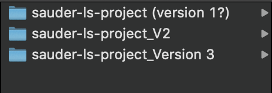
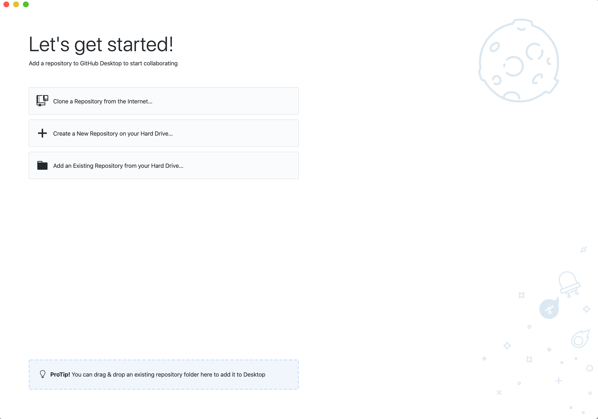
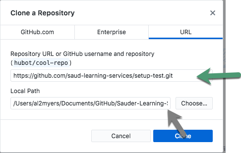
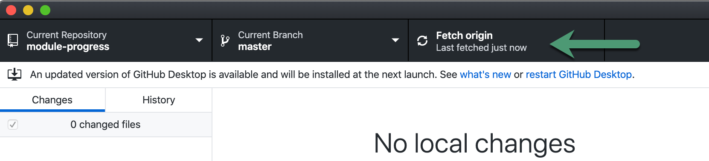

<!-- PROJECT LOGO -->
 

  

    
  

  <h3 align="center">Managing Projects with Github</h3>

  

    A Guide for Managing Sauder LS Projects using GitHub
     
    (GitHub Desktop and Terminal)
  

<!-- TABLE OF CONTENTS -->
## Table of Contents

* [What is Github?](#what-is-github)
* [Why Use It?](#why-use-it)
* [Managing Projects Using GitHub Desktop](#managing-projects-using-gitHub-desktop) (recommended for Ops)
    * [Downloading a Project (GitHub Desktop)](#downloading-a-project-(github-desktop))
    * [Updating a Project (GitHub Desktop)](#updating-a-project-(github-desktop))
* [Managing GitHub Projects Using Terminal](#managing-github-projects-using-terminal)
    * [Downloading a Project (Terminal)](#downloading-a-project-(terminal))
    * [Updating a Project (Terminal)](#updating-a-project-(terminal))

All Learning Services analytics and programming projects are hosted on our [GitHub Page](https://github.com/saud-learning-services).

## What is GitHub?

GitHub is a website that allows people to share and collaborate on software projects. All projects on GitHub use a version control system called [Git](https://git-scm.com/). For the purposes of *using* our tool's, it's enough to know that GitHub will be:
* Where you go to download the project
* How you will recieve updates

## Why Use It?

GitHub helps us with version control. Crucially, it'll help us ensure that everyone is using the most up-to-date version of our tools. It will also help us respond to problems faster and send fixed code back to our users without creating any kind of duplication or confusion around which version is correct.

_Here's a scenario we're trying to avoid..._

Imagine you download one of our tools to a folder on your computer like so:

    

Now imagine that over time, we make improvements to the tool, and let you know we've posted a second version (Version 2). You download it and name it with "V2" at the end because you don't want to just throw away version one, after all it works. And shortly after this another version comes out and your folder looks something like:

    

This has a lot of downsides:
* it makes it hard to keep track of which version is the "right" version
* data can get lost or forgotten in folders of previous versions
* users can miss crucial updates

GitHub solves this by allowing us all to connect to a single "folder in the cloud" so-to-speak, so that everyone can be sure they're on the latest version of the code.

    
    
sending out updates through GitHub

## Managing Projects Using GitHub Desktop

> Recommended for most people on the Operations team

First, you'll need a GitHub account (Don't have one? See [GitHub's instructions to create a free account](https://docs.github.com/en/free-pro-team@latest/github/getting-started-with-github/signing-up-for-a-new-github-account)). For Learning Services - get in touch to let someone from the API team and let them know you have an account and want to be added to the organization. Some projects (for LS-ops) are private and you must be a member of the organization to view them.

GitHub Desktop is a application that lets us download and contribute to with projects hosted on GitHub. To download, go [here](https://desktop.github.com/)

Once downloaded, open the application. It should look something like this:

    

### Downloading a Project (GitHub Desktop)

Select **Clone a Repository from the Internet...** You will be prompted to sign in using your GitHub login.

Once finished, under **Clone a Repository**, select the **URL** tab

    

In the top input (marked in green), enter the GitHub URL of the project you are trying to get. To find this, visit a project page on GitHub and copy the link as seen below (click "Code" then clipboard icon):

    

In the bottom input (marked in grey), enter the folder where you'd like to store and run the project from. We recommend creating a single folder somewhere accessible where you store all the Sauder LS GitHub Projects.

After selecting clone, you should be able to see the new project has appeared in the folder that you specified. This is your local copy of the project

### Updating a Project (GitHub Desktop)

When we update a project, we send those updates to GitHub where you can grab or "fetch" them for your local copy.

To do this in GitHub Desktop, select the project under **Current Repository**, make sure **Current Branch** is set to **master** and click **Fetch Origin**

    

Your project will then have the most recent version! Same location as before and if you had any data in the old project folder, it will persist.

**⚠️ While we will try to communicate major updates to our team, it is advisable to "Fetch Origin" every time you work with a script. This ensures it's up-to-date and only takes a few seconds. ⚠️**

## Managing GitHub Projects Using Terminal

Terminal is a good way of managing GitHub projects if you are:
1. Someone who is interested in programming or computers
1. Someone who may want to contribute to one of our projects
1. Someone who is interested in the fastest possible way to manage projects

> It is also an excellent way to be the envy of all your friends as you'll look like some kind of computer genius, with capabilities nothing short of magic-like 🧙‍♀️

Before reading on, you'll want to have read [terminal basics](./terminal-basics.md)

You'll also want to make sure that you have **Git** installed and an account on **GitHub** (the two often get confused, however they're different things)
* [Install Git](https://git-scm.com/book/en/v2/Getting-Started-Installing-Git)
* [Create GitHub Account](https://docs.github.com/en/free-pro-team@latest/github/getting-started-with-github/signing-up-for-a-new-github-account) and let us know you need to join the saud-learning-services organization

### Downloading a Project (Terminal)

Using the `cd` command, navigate to a folder where you'd like to store and run the project (We recommend keeping all Sauder LS projects in a single folder for ease of management)

Once you've navigated to the folder, you'll want to **clone** the project into it. This can be done using with:

`$ git clone <URL>` (where `<URL>` is HTTPS link copied from the GitHub repo)

    
    
HTTPS links to projects can be found on the project's GitHub page

### Updating a Project (Terminal)

Using the `cd` command, navigate to the folder where your copy of the project is stored
`$ cd path/to/my-project`

Check to see what branch you are on
`$ git branch` (the starred branch is your current branch; type **q** to exit)

If not on **master**, switch to it
`$ git checkout master`

While on the master branch, grab the latest changes
`$ git pull` 
