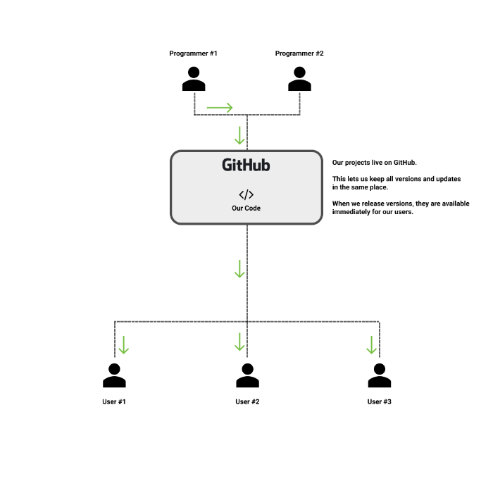

# Managing Projects Using Github

All Learning Services analytics and programming projects are hosted on our [GitHub Page](https://github.com/saud-learning-services).

## What is GitHub?

GitHub is a website that allows people to share and collaborate on software projects.

## Why do we use it?

For us, GitHub solves the problem of version control. As an example, imagine you're interested in using one of our tools and we provide you with the code. You may create a folder on your computer like so:

However, say we then release a version 2 of the project, which you download, followed shortly by a version 3. Your folder structure may start to look something like this:

This isn't ideal, as it makes it difficult to keep track of the correct version, which also make it possible to be running old versions without realizing. Another concern is that data can get lost or forgotten about in previous versions.

GitHub allows all stakeholders to connect to a "folder in the cloud" so-to-speak so that everyone involved (programmer and user) can be sure they're on the latest version of the code. See diagram below.

## How to Get Projects using GitHub Desktop

> First you'll want to make sure that you're set up with a GitHub account. TODO Link Alison's Docs for this.

There are a few common ways of using GitHub, the simplest of which is **GitHub Desktop**.

We recommend this avenue for people who are less familiar with terminal.

To get started download GitHub Desktop from [here](https://desktop.github.com/)

When first opened, the application will appear something like this:

Select **Clone a Repository from the Internet...**, at which point you'll be prompted to sign in using your GitHub credentials.

Once finished, under **Clone a Repository** select the **URL** tab

In the top input (marked in green), you'll want to provide the GitHub URL of the project you are trying to get. To find this, visit a project page on GitHub and copy the link as seen below (click "Code" then clipboard icon):

In the bottom input (marked in grey), you'll want to choose a destination folder for the project. We recommend creating a single folder somewhere accessible where you store all the Sauder LS GitHub Projects you need (for example: `Desktop/sauder-github-projects`)

After selecting clone, you should be able to see a new folder has appeared in the folder that you specified. This is your local version of the project and it's what you'll be using every time!

So how does this solve the problem of versioning?

Imainge you have gone through this process and have a local version of the project. Now, say that we push updates to the project that you'll be needing.

In this case, you'll open the GitHub desktop application, select the project under **Current Repository**, make sure **Current Branch** is set to **master** and select **Fetch Origin**.

Your project will then be updated to the latest version - same folder, same location, same everything.

> While we will try to communicate major updates to our team, it is wise to **Fetch Origin** every time you work with a script. It takes only a few seconds.

## How to Get Projects using GitHub with Terminal

Terminal is a good way of managing GitHub projects if you are:
1. Someone who is interested in programming and/or programming concepts
1. Someone who may want to contribute to one of our projects
1. Someone who is interested in the fastest possible way to manage projects

> It is also an excellent way to be the envy of all your friends as you'll look like some kind of computer genius, with capabilities nothing short of magic-like

To start, ensure you have a solid understanding of the commands mentioned in [terminal basics](./terminal-basics.md)

You'll also want to make sure that you have **Git** installed & an account for **GitHub** (yes, they are two separate things)
* [Install Git](https://git-scm.com/book/en/v2/Getting-Started-Installing-Git)
* [Create GitHub Account]() TODO Add link to Alison's docs

Navigate to a destination folder, on your computer, using `cd` (Note, we recommend keeping all Sauder LS projects in a single folder for ease of management)

For example, if you've stored a folder titled **sauder-github-projects** on your desktop, your command will look something like: `$ cd Desktop/sauder-github-projects`

Once you've navigated to the folder, you'll want to **clone** the project into it. This can be done using the `$ git clone <URL>` command.

Where you see `<URL>` you'll want to put a URL for the project you are trying to get. You can find the links by visiting the project page on GitHub (click "Code" then clipboard icon).

Once it's been cloned, you can `cd` into the project and begin working with it!

To keep up to date:

* always ensure you are on the master branch
    * `$ git checkout master` (to switch to it if you switch off)
* run `$ git pull` before every use (to download the latest version)