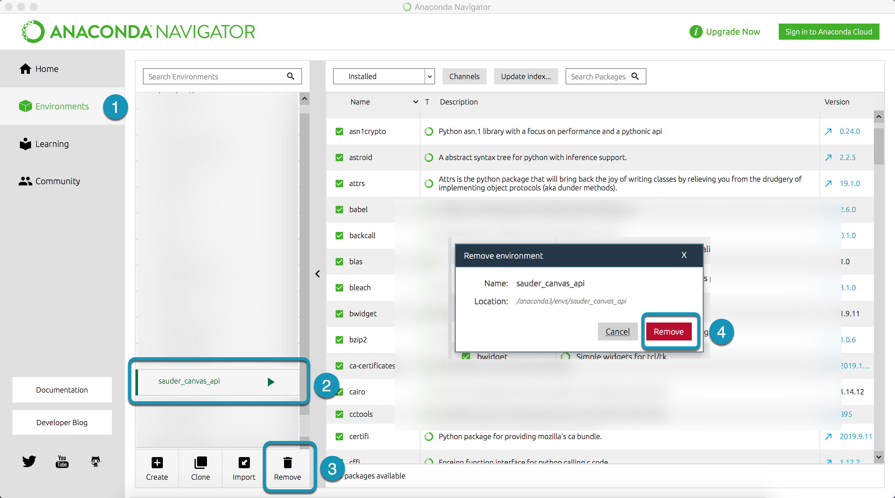

# Updating The `sauder_canvas_api` Environment

You will occasionally have to update your sauder_canvas_api environment, either due to updates in projects or the development of new projects. You can do this using the terminal or Anaconda. 

## Make sure you have the most recent version of `instructions-and-other-templates` from GitHub

## Anaconda

### 1. Remove `sauder_canvas_api` environment
a) in Anaconda -> Environments
b) select sauder_canvas_api
c) select Remove
d) confirm

### 2. Create a new `sauder_canvas_api` environment

## Terminal
